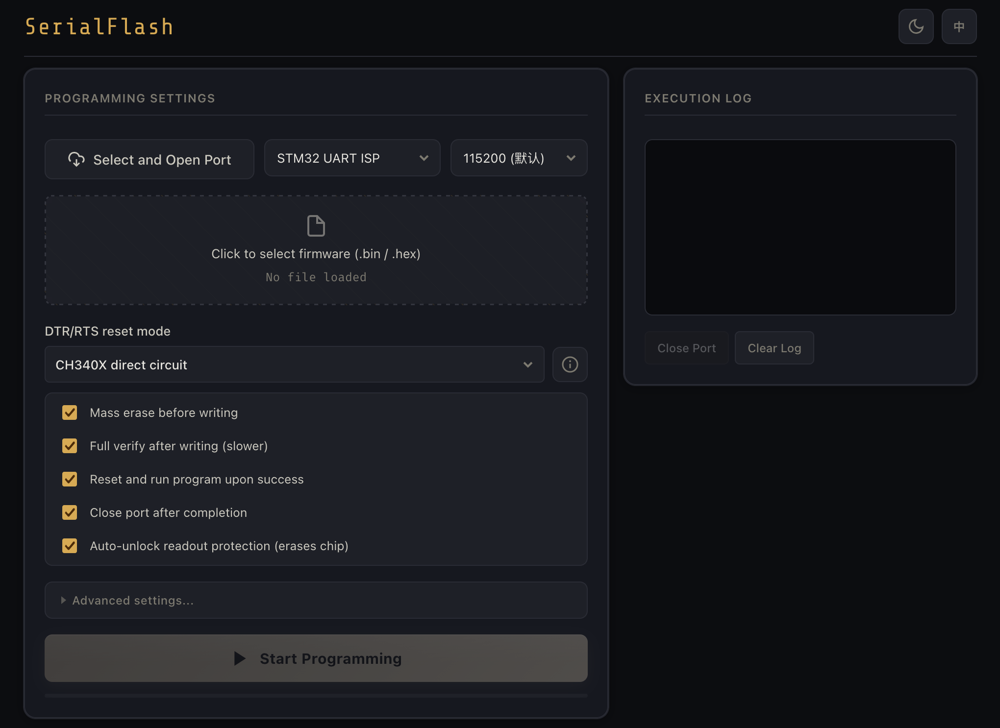

# SerialFlash

[](LICENSE)

A browser-based STM32 flashing tool using Web Serial and the STM32 USART Bootloader. Also includes a Node.js CLI for hardware validation and automated flashing. No ST-Link, no software install — just a browser (or terminal) and a USB-UART adapter.

> **中文用户**: 请参阅 [README.zh-CN.md](README.zh-CN.md)

---

## Which Version Do You Need?

This project has **two branches** for different workflows:

| Branch | Description | Best For |
| ------ | ----------- | -------- |
| [`main`](https://github.com/totok22/SerialFlash/tree/main) (you are here) | **Web Serial + CLI** — open a browser tab or use the terminal | Quick flashing without VS Code; CI/automation; any platform with a browser |
| [`vscode-extension`](https://github.com/totok22/SerialFlash/tree/vscode-extension) | **VS Code extension** — install from marketplace, flash from the editor | VS Code users who want an integrated, one-click workflow |

Both branches share the same STM32 UART ISP core, DTR/RTS reset presets, and firmware parsing logic. Pick the one that fits your setup.

---

## Screenshot



---

## Features

- **STM32 UART ISP** — auto bootloader entry, erase, write, verify, and run.
- **Supports `.bin` and Intel HEX `.hex`** firmware files.
- **Built-in CH340 presets** — CH340C classic circuit, CH340X direct-connect circuit, and common DTR/RTS combinations.
- **Read protection unlock**, post-flash run, and auto-close port.
- **Light/dark theme** and **English/Chinese** language toggle.
- **Two interfaces** — Web UI and Node.js CLI.

---

## Browser Usage (Web Serial)

Web Serial requires **Chrome or Edge** (or any Chromium-based browser) and must be served over HTTPS or `localhost`.

### Quick Start

Start a local server:

```bash
python3 -m http.server 8080
```

Then open:

```
http://127.0.0.1:8080/index.html
```

Or use the platform launchers:

- **macOS** — double-click `start.command`
- **Windows** — double-click `start.bat`

### Workflow

1. Click **"Select & Open Port"** to authorize and open the serial port.
2. Select a `.bin` or `.hex` firmware file.
3. Choose a DTR/RTS reset mode. Common presets are **CH340C Classic Circuit** and **CH340X Direct-Connect**.
4. Optionally toggle erase, full verify, run, and close-port.
5. Click **"Start Programming"**.

Progress, phase, and logs are shown in real time. Theme and language can be toggled from the top bar.

---

## CLI Usage

Install dependencies:

```bash
npm install
```

View options:

```bash
node src/cli.js --help
```

Example:

```bash
node src/cli.js \
  --port /dev/tty.usbserial-10 \
  --file firmware.hex \
  --reset ch340x \
  --timeout 3000 \
  --unlock
```

**macOS**: CH340 adapters typically show up as both `/dev/cu.*` and `/dev/tty.*`. Prefer `/dev/tty.usbserial-*` for automatic DTR/RTS bootloader entry.

**Windows**: Serial ports are typically `COM3`, `COM4`, etc.:

```bash
node src/cli.js --port COM3 --file firmware.hex --reset ch340x --timeout 3000 --unlock
```

---

## Hardware Presets

Project-wide conventions:

- `true` = low level, `false` = high level.
- Node `serialport` modem-line boolean semantics are inverted relative to the project convention — the adapter layer (`src/node-serial-transport.js`) handles negation automatically. The Web Serial path handles browser-side behavior separately.

Reset mode presets available:

| Preset | Circuit |
| ------ | ------- |
| `ch340c` | CH340C classic auto-download circuit (DTR low, RTS high) |
| `ch340x` | CH340X direct-connect circuit |
| `dtr-high-rts-low` | Generic — DTR high = reset, RTS low = BOOT0 |
| `none` | No control-line manipulation; manual bootloader entry |

For circuit diagrams, timing records, and troubleshooting notes, see [docs/CH340_HARDWARE.md](docs/CH340_HARDWARE.md). For protocol packet format, see [docs/STM32_PROTOCOL.md](docs/STM32_PROTOCOL.md).

---

## Configuration

| Option | CLI flag | Default | Description |
| ------ | -------- | ------- | ----------- |
| Port | `--port` | — | Serial port path (required) |
| Firmware | `--file` | — | `.hex` or `.bin` firmware path (required) |
| Baud rate | `--baud` | `115200` | USART baud rate |
| Reset mode | `--reset` | `ch340c` | DTR/RTS preset |
| Timeout | `--timeout` | `2000` | Read timeout in ms |
| No erase | `--no-erase` | `false` | Skip mass erase before write |
| No verify | `--no-verify` | `false` | Skip read-back verification |
| No run | `--no-run` | `false` | Don't reset and run after flash |
| No close | `--no-close` | `false` | Leave port open after flash |
| Unlock | `--unlock` | `false` | Attempt readout unprotect (erases chip) |

---

## Development

```bash
npm install
npm test

# Web UI
python3 -m http.server 8080

# CLI
node src/cli.js --help
```

The core STM32 UART ISP logic is in `src/stm32.js` and `src/firmware.js`. Transport adapters are in `src/serial-transport.js` (Web Serial) and `src/node-serial-transport.js` (Node `serialport`). See [AGENTS.md](AGENTS.md) for architecture and conventions.

---

## Known Limitations

- **Web Serial requires a user click** to trigger port authorization — browser security policy.
- **STM32 USART Bootloader only** — other protocols (SWD, DFU, etc.) are not currently supported.
- **DTR/RTS polarity varies** across download boards. When adding a new board, validate with CLI or Web presets first before relying on auto-entry.

---

## License

MIT — see [LICENSE](LICENSE) for details.
