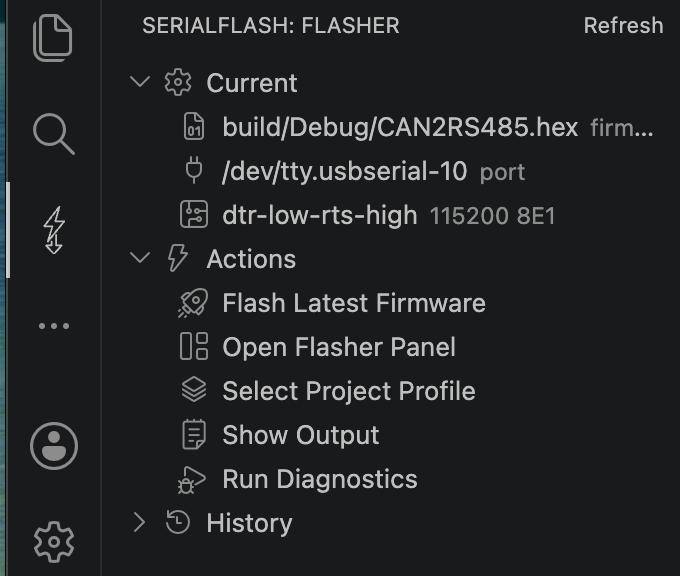

# STM32 Serial Flasher

[](https://marketplace.visualstudio.com/items?itemName=totok22.serialflash-stm32)
[](LICENSE)

在 VS Code 中通过 STM32 USART Bootloader 和本机串口直接烧录固件。无需 ST-Link、无需外部命令行工具——进入 Bootloader、擦除、写入、校验、复位运行全部在编辑器内完成。

适用于使用 CH340（或同类）USB-UART 桥 + STM32 自动下载电路的开发板。

> **English users**: see [README.md](README.md)

---

## 该选哪个分支？

本项目有**两个分支**，分别适配不同场景：

| 分支 | 说明 | 适合 |
| ---- | ---- | ---- |
| [`vscode-extension`](https://github.com/totok22/SerialFlash/tree/vscode-extension)（当前） | **VS Code 插件** — 从插件市场安装，在编辑器里烧录 | 常用 VS Code 开发、想要一键集成烧录的开发者 |
| [`main`](https://github.com/totok22/SerialFlash/tree/main) | **Web Serial + CLI** — 浏览器打开页面或用命令行烧录 | 不想装 VS Code、需要 CI/自动化、任何有浏览器的平台都能用 |

两个分支共享相同的 STM32 UART ISP 核心逻辑、DTR/RTS 复位预设和固件解析。按你的场景选一个即可。

---

## 截图



---

## 主要特性

- **自动发现固件** — 扫描工作区中的 `.hex` / `.bin` 文件，按修改时间、路径和格式排序，单一候选时自动选用。
- **一键烧录** — 进入 Bootloader → 擦除 → 写入 → 校验 → 运行，快捷键 `Cmd/Ctrl+Alt+F`。
- **记住上次配置** — 端口、固件、复位模式和波特率首次成功后自动记住，下次直接复用。
- **多种入口** — Activity Bar 侧边栏、Webview 烧录面板、命令面板、文件右键菜单、状态栏、VS Code Tasks。
- **内置 CH340 预设** — 覆盖常见 CH340C / CH340X 自动下载电路，支持完全自定义 DTR/RTS 映射。
- **诊断与排查** — 失败时在 Output 中给出针对超时、NACK、串口占用、权限、校验失败的排查建议。
- **项目 Profile** — 可为不同目标板保存多套配置，快速切换。
- **烧录历史** — 记录最近操作，含端口、地址、字节数和结果。

---

## 环境要求

- **VS Code 1.90+**（Desktop）。
- 本机已连接基于 USART Bootloader 的 STM32 开发板，以及可被系统识别的 USB-UART 串口。
- 无需额外安装驱动以外的工具，插件自带 `serialport` 原生依赖。

> Remote / Web 的运行边界见下方「运行环境与边界」。

---

## 快速开始

1. 在 VS Code 中打开你的固件工程文件夹（包含 `.hex` / `.bin` 产物的工作区）。
2. 点击 Activity Bar 上的 **SerialFlash** 图标，打开侧边栏。
3. 在 **Current** 区域依次确认三项：
   - **固件** — 留空会自动发现工作区里的固件；也可点击手动选择。
   - **串口** — 选择开发板对应的串口（macOS 优先 `/dev/tty.usbserial-*`，Windows 形如 `COM3`）。
   - **复位** — 按你的下载电路选择预设（常见 CH340C 经典电路选 `dtr-low-rts-high`）。
4. 执行 **Flash Latest Firmware**（侧边栏按钮、命令面板，或快捷键 `Cmd/Ctrl+Alt+F`）。
5. 进度、阶段和日志会显示在烧录面板与 Output 中；失败时查看 Troubleshooting 建议。

首次成功后，端口 / 固件 / 复位模式 / 波特率会被记住，之后一键即可重复烧录。

---

## 界面与入口

SerialFlash 提供多个互补的操作入口，可按习惯选用。

### 侧边栏（Activity Bar Sidebar）

点击 Activity Bar 的 SerialFlash 图标打开 **Flasher** 视图，分三组：

- **Current** — 当前固件、串口、复位模式（含波特率 / 校验位摘要）。点击任意一项即可重新选择。
- **Actions** — 常用动作快捷入口：Flash Latest Firmware、Open Flasher Panel、Select Project Profile、Show Output、Run Diagnostics。
- **History** — 最近 8 条烧录记录，成功 / 失败带图标，悬停查看时间、端口、地址和字节数。

视图标题栏的刷新按钮可手动刷新状态。

### 烧录面板（Webview Panel）

通过 **Open Flasher Panel** 命令或侧边栏打开，是功能最完整的图形界面：

- 顶部状态条显示当前阶段和进度百分比（空闲 / 烧录中 / 完成 / 失败有不同指示）。
- **烧录目标** 区集中确认固件、串口、复位三项，并提供「诊断」入口。
- **执行** 区是主烧录按钮、进度条、取消，以及「进 Bootloader / 复位运行 / 输出」快捷动作；下方用 pill 显示擦除、校验、运行、关串口、解锁等开关状态。
- 折叠区域可调整 **烧录参数**（波特率、地址、包大小、超时、校验位 + 写入选项）、**硬件复位**（custom 模式下的 DTR/RTS 映射）、**项目与自动化**（profile、项目配置、Tasks）、**维护与危险操作**（校验、擦除、解除读保护、关闭串口、清除记忆）。
- 底部展示最近日志与历史记录；诊断和 Troubleshooting 仅在有内容时出现。
- 烧录运行中会锁定配置和危险动作，只保留取消、输出和诊断。

### 命令面板（Command Palette）

所有命令以 `SerialFlash:` 前缀归类，按 `Cmd/Ctrl+Shift+P` 调用：

| 命令 | 说明 |
| ---- | ---- |
| `Flash Latest Firmware` | 烧录当前固件（无固件时自动发现 / 选择）。快捷键 `Cmd/Ctrl+Alt+F` |
| `Flash Current File` | 把当前编辑 / 右键的 `.hex`·`.bin` 设为固件并烧录 |
| `Select Firmware` | 从工作区候选中选择固件 |
| `Set as SerialFlash Firmware` | 仅把某文件设为当前固件，不烧录 |
| `Show Firmware Info` | 显示固件格式、大小、base address 等信息 |
| `Select Serial Port` | 选择串口（列表含 manufacturer、SN、VID/PID） |
| `Select Reset Mode` | 选择复位时序预设 |
| `Open Flasher Panel` | 打开图形烧录面板 |
| `Reset To Bootloader` | 仅驱动复位时序进入 Bootloader |
| `Reset And Run` | 复位并运行用户程序 |
| `Cancel Flash` | 取消正在进行的烧录 |
| `Show Output` | 打开 Output Channel 查看完整日志 |
| `Run Diagnostics` | 输出 Extension Host、`serialport` 状态、可见串口 |
| `Erase Chip` | 整片擦除（需确认） |
| `Verify Firmware` | 读回校验当前固件 |
| `Unlock Read Protection` | 解除读保护（会整片擦除，需确认） |
| `Close Port` | 释放仍打开的串口 |
| `Clear Remembered Device` | 清除记住的端口 / 固件 / 复位 / 波特率 |
| `Create Project Config` | 把当前配置写入 `.vscode/settings.json` |
| `Create Tasks` | 生成 `.vscode/tasks.json` 任务 |
| `Create Project Profile` | 把当前配置保存为命名 profile |
| `Select Project Profile` | 在多个 profile 间切换 |
| `Clear Flash History` | 清空烧录历史 |

### 文件右键菜单

在 Explorer 或编辑器标签页右键 `.hex` / `.bin` 文件，可直接 **Flash Current File**、**Verify Firmware**、**Set as SerialFlash Firmware**、**Show Firmware Info**。

### 状态栏

状态栏左侧显示当前端口；烧录中显示阶段和进度，点击可打开面板或输出。

---

## 复位模式与硬件

进入 Bootloader 依赖正确的 DTR/RTS 时序。`serialFlash.resetMode` 可选：

- `dtr-low-rts-high` — CH340C 经典自动下载电路（默认）。
- `ch340x` — CH340X 直连电路。
- `dtr-high-rts-low` — 通用预设（DTR 高复位 / RTS 低进 BOOT）。
- `none` — 不驱动控制线，手动按键进入 Bootloader。
- `custom` — 通过 `serialFlash.customReset.*` 自定义映射。

硬件约定与注意事项：

- 自定义映射时项目约定 `true` 为低电平、`false` 为高电平。
- CH340C 与 CH340X 电路不要混用预设，时序不同会导致进不去 Bootloader。
- macOS 端口排序优先 `/dev/tty.usbserial-*`，再考虑 `/dev/cu.usbserial-*`。
- STM32 USART Bootloader 默认使用 `115200 8E1`。
- 不确定该选哪个预设时，先用默认 `dtr-low-rts-high` 试；若一直超时，改用 `Reset To Bootloader` 配合手动按键确认接线，再逐个尝试其他预设。

电路图、时序记录和排查经验见 [docs/CH340_HARDWARE.md](docs/CH340_HARDWARE.md)；协议包格式见 [docs/STM32_PROTOCOL.md](docs/STM32_PROTOCOL.md)。

---

## 项目配置、Profile 与任务

- **Create Project Config** 把当前配置写入工作区 `.vscode/settings.json`，保留已有 VS Code 设置。
- **Create Project Profile** 把当前配置保存到 `serialFlash.projects`，适合一个工作区有多块板 / 多个固件；**Select Project Profile** 快速切换。
- **Create Tasks** 写入 `.vscode/tasks.json`，生成 flash / bootloader / run 三个任务并保留已有任务。也可手动声明 `serialFlash` 类型任务：

```json
{
  "label": "Flash Latest Firmware",
  "type": "serialFlash",
  "action": "flashLatest"
}
```

`action` 可选 `flashLatest`、`bootloader`、`run`。

> 以上写文件的命令需要先打开一个工作区文件夹。仅修改设置时若没有工作区，会自动写入用户全局设置。

---

## 配置参考

烧录流程的四个写入开关（面板和配置中均可调整）：

| 选项 | 默认 | 作用 |
| ---- | ---- | ---- |
| `eraseBeforeWrite` | 开 | 写入前整片擦除，避免残留旧程序 |
| `verifyAfterWrite` | 开 | 写入后读回校验，较慢但能确认写入正确 |
| `runAfterWrite` | 开 | 烧录成功后复位并运行用户程序 |
| `closePortAfterWrite` | 开 | 完成后关闭串口；关掉它可让端口保持打开供调试 |

完整设置示例（可在工作区或用户设置中配置）：

```json
{
  "serialFlash.firmware": "build/Debug/app.hex",
  "serialFlash.port": "/dev/tty.usbserial-10",
  "serialFlash.baudRate": 115200,
  "serialFlash.parity": "even",
  "serialFlash.resetMode": "dtr-low-rts-high",
  "serialFlash.customReset.boot0High": "dtr-false",
  "serialFlash.customReset.boot0Low": "",
  "serialFlash.customReset.resetAssert": "rts-true",
  "serialFlash.flashAddress": "0x08000000",
  "serialFlash.packetSize": 256,
  "serialFlash.timeout": 2000,
  "serialFlash.eraseBeforeWrite": true,
  "serialFlash.verifyAfterWrite": true,
  "serialFlash.runAfterWrite": true,
  "serialFlash.closePortAfterWrite": true,
  "serialFlash.unlockReadProtection": false,
  "serialFlash.autoDiscoverFirmware": true,
  "serialFlash.firmwareGlobs": ["**/*.hex", "**/*.bin"],
  "serialFlash.excludeGlobs": ["**/{node_modules,.git,dist}/**"],
  "serialFlash.projects": [
    {
      "name": "can2rs485",
      "firmware": "CAN2RS485/build/Debug/CAN2RS485.hex",
      "port": "/dev/tty.usbserial-10",
      "resetMode": "ch340x"
    }
  ]
}
```

要点：

- `serialFlash.flashAddress` 未显式配置时，HEX 固件优先使用文件内的 base address，BIN 固件默认 `0x08000000`。
- `serialFlash.firmwareGlobs` / `serialFlash.excludeGlobs` 用于收窄固件扫描范围，避免工作区内多个产物互相干扰。
- `serialFlash.unlockReadProtection` 仅在确认芯片处于读保护状态时开启，它会触发整片擦除。

---

## 运行环境与边界

- 完整支持 VS Code Desktop 本地 macOS / Windows / Linux。
- Remote SSH / WSL / Dev Container 中只能访问 **Extension Host 实际运行端机器** 上的串口；激活时会提示当前 Extension Host，避免误选本机不存在的串口。
- 不支持 vscode.dev / github.dev 烧录，因为 Web 扩展无法使用 Node `serialport`。
- 同步 Bootloader 时会忽略进入 ACK 前的非 Bootloader 噪声字节，便于处理用户程序的残留输出。

---

## 常见问题排查

烧录失败时，面板的 Troubleshooting 区和 Output 会给出具体建议。常见情况：

| 现象 | 原因与处理 |
| ---- | ---------- |
| 串口被占用 / busy / access denied | 关闭占用该串口的串口监视器、终端、其它烧录工具或上一轮未释放的连接 |
| 权限不足 / EACCES / EPERM | 检查串口权限；Linux 通常需把当前用户加入 `dialout`（或 `uucp`）组后重新登录 |
| 一直超时、收不到 Bootloader ACK | 确认 BOOT0/RESET 接线、复位模式、端口选择和 `115200 8E1`；可先用 `Reset To Bootloader` 或手动进入 Bootloader 验证，再换其他复位预设 |
| 收到非 Bootloader 数据 | 目标可能仍在运行用户程序并输出串口数据，先确认已进入 ROM Bootloader |
| 返回 NACK | 检查芯片读保护、flash 地址、擦除状态，以及该命令是否被当前 Bootloader 支持 |
| 校验失败 | 确认固件对应当前板卡、`flashAddress` / HEX base address 正确，重新擦除后再烧录 |
| 固件解析失败 | 重新构建或导出 `.hex` / `.bin`，确认文件不是日志、ELF 或被截断的产物 |
| serialport 原生依赖不可用 | 重新安装依赖或用打包好的 VSIX 安装，并运行 `Run Diagnostics` |

仍无法定位时，运行 `Run Diagnostics` 记录端口、复位模式、Bootloader 版本和 PID，便于进一步排查。

---

## 开发

```bash
npm install
npm test
npm run package
```

在 VS Code 中打开本仓库，使用 Extension Development Host（F5）调试插件。核心 STM32 UART ISP 逻辑位于 `src/core` 与 `src/stm32.js`，VS Code 集成位于 `src/vscode`。架构与约定见 [AGENTS.md](AGENTS.md)。

### 打包

```bash
npm run package
```

生成的 VSIX 会包含生产依赖 `serialport`。实机验证记录模板见 [docs/HARDWARE_VALIDATION.md](docs/HARDWARE_VALIDATION.md)。

### 发布

发布前确认 `CHANGELOG.md` 已写入当前版本，且 `npm test` 与 `npm run package` 均通过。登录 publisher 后执行：

```bash
npm run publish
```

---

## 许可证

MIT — 详见 [LICENSE](LICENSE)。
