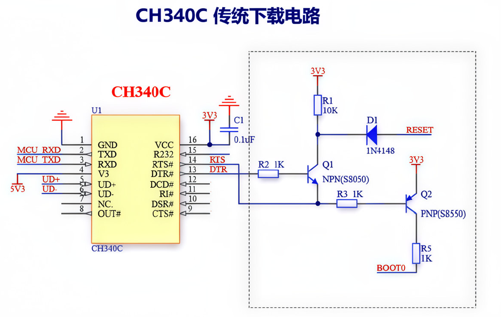
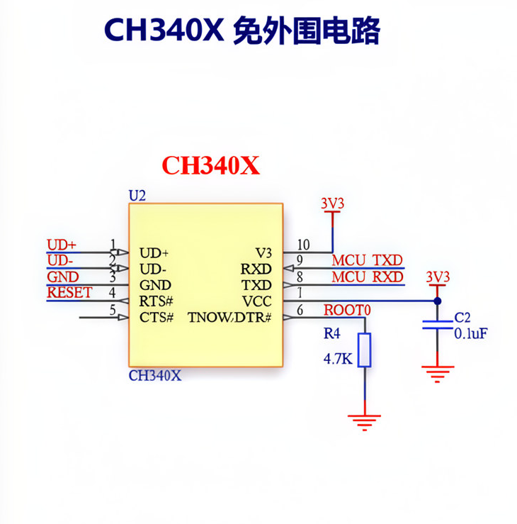

# CH340 DTR/RTS 硬件说明

## 电平约定

项目内部统一约定：

- `true`：低电平。
- `false`：高电平。

Node `serialport` 的 modem 线布尔值语义相反，因此 `src/node-serial-transport.js` 内部会对 DTR/RTS 取反。

## 经典 CH340C 电路

常见 STM32 串口下载板会在 CH340C 外围加入三极管电路：

- DTR 参与 RESET 控制。
- RTS 参与 BOOT0/ISP 选择。
- DTR 和 RTS 同电平时，三极管通常截止，引脚由板载上下拉决定。
- DTR 和 RTS 一高一低时，电路会主动驱动 RESET 或 BOOT0。

验证入口序列：

1. RTS 低电平。
2. DTR 低电平。
3. DTR 高电平。
4. 等待约 800ms。
5. 发送 STM32 同步字节 `0x7F`。

等价的 `stm32flash` 验证命令：

```bash
stm32flash -b 115200 -i -rts,-dtr,dtr /dev/tty.usbserial-10
```

CLI 验证命令：

```bash
node src/cli.js \
  --port /dev/tty.usbserial-10 \
  --file /Users/poli/STM32CubeIDE/workspace_2.1.1/PDM/Debug/PDM.hex \
  --reset dtr-low-rts-high \
  --timeout 3000 \
  --unlock
```

验证对象：

- CH340C 经典电路。
- STM32F10xxx Medium-density。
- Bootloader `0x22`。
- PID `0x0410`。



## CH340X 直连电路

部分 CH340X 板子会更直接地连接 modem 输出：

- 一根线控制 RESET。
- 一根线控制 BOOT0。
- 有效极性可能与经典 CH340C 三极管电路不同。

不要把 CH340C 序列直接套用到 CH340X。CH340X 应独立成预设，并通过硬件验证。

## CH340X 实测时序

2026-06-05 使用 CAN2RS485 板实测，`ch340x` 预设入口时序为：

1. RTS 运行态，DTR 释放 RESET。
2. RTS 进入 Bootloader 条件，DTR 保持释放。
3. RTS 保持 Bootloader 条件，DTR 触发 RESET。
4. RTS 保持 Bootloader 条件，DTR 释放 RESET。
5. 等待约 1000ms 后发送 STM32 同步字节 `0x7F`。

退出运行时序：

1. RTS 退出 Bootloader 条件，DTR 保持运行复位初态。
2. RTS 保持运行态，DTR 切换到相反电平触发 RESET。
3. RTS 保持运行态，DTR 回到初态，释放 RESET 运行用户程序。

项目实现：

- `ch340x` 预设直接合成上述物理时序。
- 入口：建立 BOOT 条件后脉冲 RESET，再释放 RESET 进入通讯态。
- 退出：退出 BOOT 条件后使用实测相反 RESET 极性脉冲，释放复位运行用户程序。
- Node `serialport` 仍由 `src/node-serial-transport.js` 负责取反。

验证对象：

- CH340X 直连电路 CAN2RS485 板。
- macOS 端口 `/dev/tty.usbserial-10`。
- 固件 `/Users/poli/STM32CubeIDE/workspace_2.1.1/CAN2RS485/build/Debug/CAN2RS485.hex`。
- Bootloader `0x31`。
- PID `0x0413`。
- CLI 确认有效入口组合 `RTS BOOT=true / DTR RESET=false`。
- 擦除、写入、读回校验完成。



## 调试经验

- `0x7F` 同步超时通常是没有进入 ROM Bootloader，不应先改擦写协议。
- 收到持续乱码或 `0x43` 一类字节，通常是用户程序或其它 Bootloader 在输出。
- Web Serial 和 Node `serialport` 的 DTR/RTS 布尔语义不同；同一块板在 Web 和 CLI 侧可能需要相反布尔值。
- CH340X 板烧写后若端口保持打开，DTR/RTS 可能继续影响运行；Web 端提供完成后关闭串口选项。
- 较大容量 STM32 的全片擦除可能超过 15 秒，当前 ACK 等待为 60 秒。

## 排查清单

- 使用 `115200 8E1`。
- macOS CLI 自动复位优先使用 `/dev/tty.usbserial-*`。
- 如果持续读到用户程序输出，说明没有进入 ROM Bootloader。
- 如果 Sync 成功但 GET 超时，先检查 STM32 响应解析，不要先改硬件时序。
- 新板型改预设前，先用 `stm32flash` 或只读命令验证。
